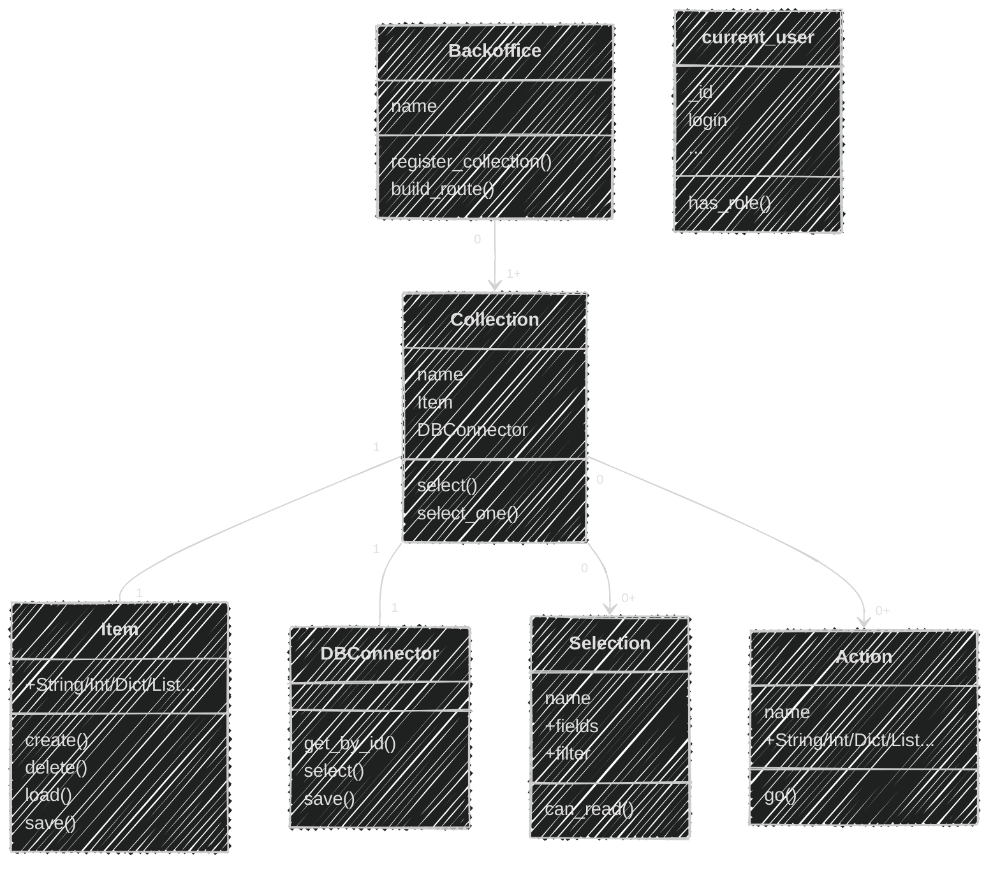
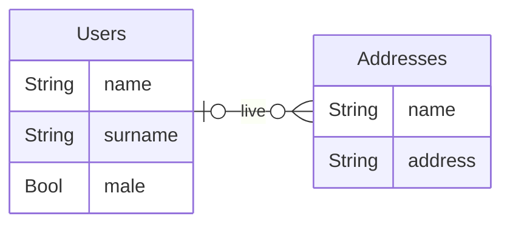
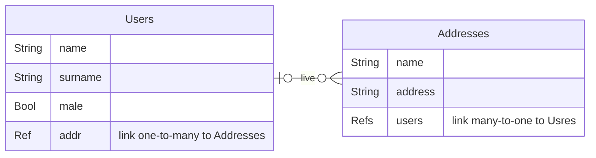
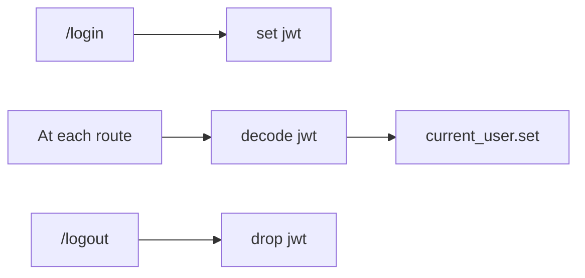

---
# try also 'default' to start simple
theme: dracula
# random image from a curated Unsplash collection by Anthony
# like them? see https://unsplash.comections/94734566/slidev
# background: https://cover.sli.dev
# some information about your slides (markdown enabled)
title: Backo - stricto
subtitle: ORM + API restfull
author: Bertrand Wallrich
# https://sli.dev/features/drawing
drawings:
  persist: false
# slide transition: https://sli.dev/guide/animations.html#slide-transitions
transition: slide-left
# enable Comark Syntax: https://comark.dev/syntax/markdown
comark: true
# duration of the presentation
duration: 35min
layout: cover
---

# Backo - Stricto

Backoffice low code

ORM + API restfull

<footer position="absolute">

<div class="grid grid-cols-4 gap-4">
  <div>
  


  </div>
  <div>


  </div>
</div>

</footer>


---
layout: cover
---


## Plan


<Toc text-sm minDepth="0" maxDepth="1" columns="2"/>


---
layout: two-cols
---

## Disclaimers 

::left::


<div v-click>

<Transform :scale="0.8" origin="bottom center">


</Transform>

</div>

::right::

<div v-click.fade-in>

* __For developpers__, not  _idiot proof_ (A lot of callback/lamdba. You can do what you want, including horrors), no ```limitations```
* __Work in progress__, but already usable
* __Full documented__, but "_complex_" (a lot of stuff linked together)
* __Choices__
  * language = python
  * reduced list of deps : flask, json, API restfull, JWT
  * __MIT Licence__
* __Performance ?__ (actually not important)


</div>


---
layout: section
---
# General

---
layout: two-cols-header
---

## Purpose

::left::
### Dev point of vue

<div v-click>

_...We all do Data Management even if we don't want..._

</div>
<div v-click>

A backoffice, responding to API restfull (or not) routes, with autentication and RBAC, views, sanity check, security check, database management, error management, workflows, integration... and business logic code !


- A lot of code in the front too
  - *sanity check*
  - *security check*
  - business logic code

</div>

::right::

### User point of vue
<div v-click>

_...just a small app to handle ..._


</div>
<div v-click>

* Translation :
  * A backoffice (and a frontoffice) 
  * Some autentication and some rights and access control
  * A lot of _conditions_ (a field exist only in some cases)
  * Some dependances (computation) beetween fields
  * get some data from another application
  * ... 

</div>


---
layout: section
---

# How it works





---
layout: two-cols-header
---

## Backoffice and Collections
The main part

::left::


```python

# set the flask application route
flask = Flask("my_media_library")

@flask.route("/login", methods=["POST"])
def log_in():
    """login and return a token"""
    token = jwt.encode(...)
    response = make_response(json.dumps({"login": "ok"}))
    response.set_cookie("jwt_token", token)
    return response


def check_user_token() -> None | Response:
    """Decode the jwt token and set current_user"""
    token = request.cookies.get("jwt_token")
    data = jwt.decode(token, "myappsecretkey")
    current_user.set(data["user"])
    return None

```


::right::

```python

@flask.route("/logout")
@token_required
def logout():
    """clear the jwt in cookie"""
    response = make_response(json.dumps({"logout": True}))
    response.delete_cookie("jwt_token")
    return response

myapp = Backoffice("media_library")
myapp.add_collection(books)
myapp.add_collection(users)

myapp.build_routes(flask, "v1", check_user_token)

flask.run(host="0.0.0.0", port=5000)
```


---
layout: two-cols
---

## Item

Description of the object structure (fields) in a collection

::left::

  * type of the field (```Int```, ```Float```, ```String```, ```List```, ```Dict```, ```Tuple```, ... )
    * references (<kbd>Ref</kbd> et <kbd>RefsList</kbd>) to other collections
  * _constraints_ (require, ... )
  * _rights_ (```read``` and ```modify```)
  * conditional ( existence of this field according to another)
   * computed (the field is the result of a function on the Item ) 
  * _events_ callbacks
  * _transform_ function

::right::


::code-group

```python [main] {hide|all|3,11,14,15|5|12,17|21-24|26|all}
books_item = Item(
    {
        "title": String(require=True),
        "pages": Int(),
        "borrowed": Bool(set=set_borrowed),
        "borrow": Dict(
            {
                "user": Ref(
                    coll="users",
                    field="$.rent.books",
                    require=True,
                    can_read=can_read_borrow_user,
                ),
                "return_date": Datetime(require=True),
                "date": Datetime(require=True),
            },
            can_modify=can_modify_borrow,
        ),
    }
)

connector = DBMongoConnector(
    connection_string="mongodb://...", collection="Books"
)

books = Collection("books", books_item, connector)
```

```python [set]
def set_borrowed(book: Item) -> bool:
    """compute if the book is currently borrowed

    :param book: the current book
    :type book: Item
    :return: borrowed or not
    :rtype: bool
    """
    if book.borrow is None:
        return False
    if book.borrow.return_date is None:
        return False
    if book.borrow.return_date > datetime.now():
        return True
    return False
```

```python [rights]
def can_modify_borrow(right_name: str, book: Item) -> bool:
    """Tel if current_user can modify 
       the borrow part of the book
    """
    if current_user.has_role(["ADMIN", "EMPLOYEE"]):
        return True

    if book.borrowed is False:
        return True

    return False
```

::


---
layout: two-cols-header
---


## Everything is _almost_ value or function

::left::

* set = func

_Must return a value of the same type of the object_

```python

def set_borrowed(book: Item) -> bool:
    """compute if the book is currently borrowed

    :param book: the current book
    :type book: Item
    :return: borrowed or not
    :rtype: bool
    """
    if book.borrow is None:
        return False
    if book.borrow.return_date is None:
        return False
    if book.borrow.return_date > datetime.now():
        return True
    return False

```

::right::

* can_read|can_modify = func|value

_Must return a bool ```bool```_

```python

def can_modify_borrow(right_name: str, book: Item) -> bool:
    """Tel if current_user can modify the borrow part of the book

    :param right_name: The name of the right (here ="modify")
    :type right_name: str
    :param book: The book
    :type book: Item
    :return: True if can modify
    :rtype: bool
    """
    if current_user.has_role(["ADMIN", "EMPLOYEE"]):
        return True

    if book.borrowed is False:
        return True

    return False

```


---
layout: two-cols
---


## References (1/3)

* link between objets (colletions)
* <span v-mark.red=2>keep the database consistency</span>

<kbd>Ref</kbd> and <kbd>RefsList</kbd>

::left::



<div v-click>



</div>

::right::


```python {hide|all|2,16|3-11,17-24|12,25|7-9,21-23|all}
my_backoffice.add_collection(
    "users",
    Item(
        {
            "name": String(),
            "surname": String(),
            "addr": Ref(
              coll="addrs", field="$.users", required=True
            ),
            "male": Bool(default=True),
        }),
    yml_users
)

my_backoffice.add_collection(
    "addrs",
    Item(
        {
            "name": String(),
            "address": String(),
            "users": RefsList(
                coll="users", field="$.addr"
            ),
        }),
    yml_addr,
    )
```


---
layout: two-cols-header
---

## References (2/3) - database consistency

::left::

<Transform :scale="0.9">

```python {2,7-9,16,21-23}
my_backoffice.add_collection(
    "users",
    Item(
        {
            "name": String(),
            "surname": String(),
            "addr": Ref(
              coll="addrs", field="$.users", required=True
            ),
            "male": Bool(default=True),
        }),
    yml_users
)
my_backoffice.add_collection(
    "addrs",
    Item(
        {
            "name": String(),
            "address": String(),
            "users": RefsList(
                coll="users", field="$.addr"
            ),
        }),
    yml_addr,
    )
```

</Transform>

::right::


<Transform :scale="0.9">

```python {hide|all}
# Create addr
moon = my_backoffice.addrs.create({"name": "moon", 
            "address": "far", "users": [] })
mars = my_backoffice.addrs.create({"name": "mars", 
            "address": "very far", "users": [] })
# Create users
neil = my_backoffice.users.create({"name": "amstrong", 
            "addr": moon._id})
matt = my_backoffice.users.create({"name": "damon", 
            "addr": mars._id})

moon.reload()
mars.reload()
len(moon.users) # -> 1
moon.delete()  # raise Error (not empty) !

# matt goes back to moon
matt.addr = moon._id
matt.save()

moon.reload()
mars.reload()

len(moon.users) # -> 2
len(mars.users) # -> 0

mars.delete()  # Ok (sorry Elon)

```

</Transform>


---
layout: two-cols-header
---

## References (3/3) - options

::left::

### Main

| Item A | Item B | description |
| -- | -- | -- |
| <kbd>Ref</kbd> | <kbd>Ref</kbd> | 0 or one to one |
| <kbd>Ref</kbd> | <kbd>RefsList</kbd> | 0 or one to many |
| <kbd>Ref(require=True)</kbd> | <kbd>RefsList</kbd> | One to many |
| <kbd>RefsList</kbd> | <kbd>RefsList</kbd> | Many to many |


::right::

<div v-click>


### RefsList

<Transform :scale="0.9">


* <kbd>ofs=</kbd> On Fill Strategy : fill the value ?
  * ```FillStrategy.FILL``` (by default) fill it
  * ```FillStrategy.NOT_FILL``` just keep ref

* <kbd>ods=</kbd> On Delete Strategy : what append when delete this item ?
  * ```DeleteStrategy.MUST_BE_EMPTY``` (by default) drop only if empty
  * ```DeleteStrategy.DELETE_REFERENCED_ITEMS``` drop all 
  * ```DeleteStrategy.UNLINK_REFERENCED_ITEMS``` references are lost


</Transform>

</div>


---
layout: section
---

# Habilitation
Role-Based Access Control


---
layout: two-cols-header
---

## current_user

::left::


* ```current_user``` est un objet fourni par backo :
  * des informations sur l'utilisateur actuellement connecté (```_id```, ```login```, ```roles``` )
  * methodes :
    * ```has_role( role: str | list[str] )``` qui dit si l'utilsateur a le role ou pas
    * ```set( data )``` qui positionne les valeurs
  
  



::right::

::code-group

```python [main]
@flask.route("/login", methods=["POST"])
def log_in():
    """check the login"""
    # Do the login or drop if wrong /login/password 
    login = request.json["login"]
    password = request.json["password"]

    # Set the token
    token = jwt.encode(
        {
            "exp": datetime.now(timezone.utc) 
                    + timedelta(hours=1),
            "user": {
                "_id": user._id.get_value(),
                "login": user.login.get_value(),
                "roles": user.roles.get_value(),
            },
        },
        "myappsecretkey", algorithm="HS256",
    )
    response = make_response(json.dumps({"login": "ok"}))
    response.set_cookie("jwt_token", token)
    return response

```


```python [check]
def check_user_token() -> None | Response:
    """
    Decode the jwt token and set current_user.
    """
    token = request.cookies.get("jwt_token")
    if not token:
        return jsonify({"message": "Token missing!"}), 401
    try:
        data = jwt.decode(
                 token, "myappsecretkey", 
                 algorithms=["HS256"]
               )
    except:  # pylint: disable=bare-except
        return jsonify({"message": "Token invalid!"}), 401
    current_user.set(data["user"])
    return None
```
```python [use]
def can_modify_borrow(right_name: str, book: Item) -> bool:
    """Tel if current_user can modify 
       the borrow part 
    """
    if current_user.has_role(["ADMIN", "EMPLOYEE"]):
        return True

    return False

```

::


---
---

## More options

* ```**kwargs```:
  * <kbd>constraint</kbd>= ```func``` -- a function to check if the value is admissible
  * <kbd>constraints</kbd>= ```[func]``` -- a list of function to check if the value is admissible
  * <kbd>default</kbd>= ```Any``` -- default value
  * <kbd>description</kbd>= ```str``` -- a description of this field (like a comment)
  * <span v-mark.red><kbd>exists</kbd>=</span> ```bool|func``` -- answer if this field exists or not
  * <kbd>in</kbd>= ```[Any]``` -- a list of available values
  * <kbd>require</kbd>= ```bool``` -- if this field cannot be None
  * <kbd>set</kbd>= ```func``` -- a compute value
  * <kbd>transform</kbd>= ```func``` -- a function to modify the value BEFORE affectation
  * <kbd>on</kbd>= [ ( ```event_name``` ,```func``` ) ] -- Do the action on an event

---
layout: two-cols-header
---

## exists=
Avoir des champs conditionnels, indépendant des droits.

::left::

```python {all|10-18|17|2-8}
# example
def check_if_female(value: Any, o: Item) -> bool:
    """
    return true if Female
    """
    if o.gender == "Male":
        return False
    return True

cat=Item({
    "name" : String(),
    "gender" : String( default = 'Male', 
                       in=[ 'Male', 'Female' ]),
    "female_infos" : Dict(
        {
        "number_of_litter" : Int(default=0, required=True)
        # ... some other attributes
    }, exists=check_if_female )
})

```

::right::


```python {hide|all}

cat.set({ "name" : "Felix", "gender" : "Male" }
cat.female_infos   # -> None
cat.female_infos.number_of_litter = 2 # -> Raise an Error

cat.gender = "Female"
cat.female_infos.number_of_litter = 2 # -> Ok
cat.female_infos # -> { "number_of_litter" : 2 }
```


---
layout: section
---

# Api routing


---
---

## Routes
Generated CRUD++ routes

<v-switch>
<template #1>


```python {all,13}
@flask.route("/logout")
@token_required
def logout():
    """clear the jwt in cookie"""
    response = make_response(json.dumps({"logout": True}))
    response.delete_cookie("jwt_token")
    return response

myapp = Backoffice("media_library")
myapp.add_collection(books)
myapp.add_collection(users)

myapp.build_routes(flask, "", check_user_token)

flask.run(host="0.0.0.0", port=5000)
```

</template>
<template #2>


| Method | Route | Description |
| -- | -- | -- |
| <kbd>GET</kbd> | \<my-app-name\>/\<collection name\>/\<_id\> | get an object by _id |
| <kbd>GET</kbd> | \<my-app-name\>/\<collection name\>?\<query_string\> | select objects |
| <kbd>POST</kbd> | \<my-app-name\>/\<collection name\>?\<query_string\> | select objects |
| <kbd>POST</kbd> | \<my-app-name\>/\<collection name\> | create a new object |
| <kbd>PUT</kbd> | \<my-app-name\>/\<collection name\>/\<_id\> | modify an object |
| <kbd>PATCH</kbd> | \<my-app-name\>/\<collection name\>/\<_id\> | modify an object |
| <kbd>DELETE</kbd> | \<my-app-name\>/\<collection name\>/\<_id\> | delete an object |
| <kbd>POST</kbd> | \<my-app-name\>/\<collection name\>/_check | check a possible value |

</template>
<template #3>

Get a user
```bash
curl -X GET 'http://localhost/myApp/users/123'
```

Select all users whose name includes 'do' and present the result list with 10 items per page.
```bash
curl -X GET 'http://localhost/myApp/users/?name.$re=do&_page=10'  
```
Create a new user
```bash
curl -X POST 'http://localhost/myApp/users/' -d '{"name":"John","surname":"Rambo"}'
```
Modify a user
```bash
curl -X PUT 'http://localhost/myApp/users/1234' -d '{"name":"Johnny"}'
```
Patch a user ( see [rfc6902](https://datatracker.ietf.org/doc/html/rfc6902) )
```bash
curl -X PATCH  'http://localhost/myApp/users/1234' -d '{"op": "replace", "path" : "$.name", "value": "Gilda"}'
```

</template>
<template #4>

Check a value

```bash
curl -X POST 'http://localhost/myApp/users/_check' -d \
  '{ "item" : { "name" : "John", "surname" : 32 }, "path" : "$.surname" }'
# will check surname an return a response.data like 
{
    'error' : "$.surname: Must be a string"
}
```

```bash
curl -X POST 'http://localhost/myApp/users/_check' -d \
 '{ "item" : { "surname" : "Johnny" }, "path" : "$.surname" }' 
# will check surname an return a response.data like 
{
    'error' : null
}
```

</template>
</v-switch>


---
zoom: 0.7
---

## Filtering
Get a list of objects matching the query string.


<v-switch>
<template #1>

The query string can be with this format

| key | value | description |
| - | - | - |
| \<field\> | \<value\> | matches items where `<field>` equals `<value>` |
| \<field\>.\<operator\> | \<value\> | matches items where `<field>` satisfies `<operator>` with `<value>` |
| \<field\>.\<subfield\> | \<value\> | Matches items where `<field>` is a nested dictionary containing `<subfield>` equal to `<value>` |
| \<field\>.\<subfield\>.\<operator\> | \<value\> | Matches items where `<field>` is a nested dictionary containing `<subfield>` satisfies `<operator>` with `<value>` |


* Example
```bash
curl -X GET 'http://localhost/myApp/users/?name.$re=do&$age.$gt=18'  
```

</template>
<template #2>

| key | value | default | description |
| - | - | - | - |
| <kbd>_view</kbd> | string | "client" | selects the view ([stricto views](https://github.com/bwallrich/stricto?tab=readme-ov-file#views))  |
| <kbd>_page</kbd> | int | - | sets the desired number of items per page in paginated data presentation |
| <kbd>_skip</kbd> | int | - | skips the n-first items of the result list in paginated data presentation. |


The request returns a HTTP status `200` with that JSON object:

```python
{
    "result": # list of dict containing objects matched
    "total": # (int) total number of object matched
    "_view": # the _view given in the request
    "_skip": # the _skip given in the request
    "_page": # the _page given in the request
}
```

</template>
<template #3>
Operators

| operator | syntax | example | description |
| - | - | - | - |
| $and | ( "$and", [ condition, condition ] ) | ( "\$and", [ ( "\$gt", 1 ), ( "\$lt" : 2 )]) | Do an *and* on conditions |
| $or | ( "$or", [ condition, condition ] ) |  ( "\$or", [ ( "\$gt", 10 ), ( "$eq" : 0 )]) | Do an *or* on conditions |
| $eq | ( "$eq", value ) |  ( "\$eq", "toto" ) | Equality |
| $ne | ( "$ne", value ) |  ( "\$ne", "toto" ) | Not equal |
| $lt | ( "$lt", value ) |  ( "\$lt", 1 ) | Less than |
| $lte | ( "$lte", value ) |  ( "\$lte", 1 ) | Less than or equal |
| $gt | ( "$gt", value ) |  ( "\$gt", 1 ) | Greater than |
| $gte | ( "$gte", value ) |  ( "\$gte", 1 ) | Greater than or equal |
| $not | ( "$not", condition ) |  ( "\$not", ... ) | Not |
| $reg | ( "$reg", regexp ) |  ( "\$reg", r'Jo' ) | A regular expression; match only on strings (match "start with Jo" in this example.) |
| $contains | ( "$contains", condition ) |  ( "\$contains", ( "$reg", r'^Jo' ) ) | a list contains one or more elements matching the condition |

</template>


</v-switch>

---
layout: two-cols-header
zoom: 0.9
---

## Path

::left::


Utilisé pour les selecteurs [rfc9535](https://datatracker.ietf.org/doc/rfc9535/)

```python
from stricto import Int, List, String, Dict, Error

a = Dict(
    {
        "a": Int(default=1),
        "b": Dict({
            "l" : List( Dict({
                "i" : String()
            }) )
        }),
        "c": Tuple( (Int(), String()) )
    }
)
a.set({ "a" : 12, 
        "b" : { 
          "l" : [ 
            { "i" : "fir" }, 
            { "i" : "sec"}
          ]}, 
        "c" : ( 22, "h") 
      })
```

::right::


| Caracter | Definition |
| -- | -- |
| <kbd>$</kbd> | racine de l objet |
| <kbd>*</kbd> | all |
| <kbd>:</kbd> | slice |

```python

a.select('$.a') # 12

# To make the difference :

a.select('$.f.d') # None
a.f.d # -> raise an error

a.select("$.b.l[0].i") # "fir"
a.select("$.*.l.i") # ["fir", "sec"]
a.select("$.*.l[0:2].i") # ["fir", "sec"]

# multi_select
a.multi_select( [ "$.a", "$.c" ] ) # [ 12 , ( 22, "h") ]
```
---
zoom: 0.7
---

## Examples


```python
user = Item(
    {
        "name"    : String()
        "surname" : String()
        "incomes" : Dict({
                "salary" : Int(),
                "royalties" : Int(),
                
        }),
    }
)

user.set( { "name" : "John", "surname" : "Doe", "incomes" : { "salary" : 50000 }})
user.save()

```

<div v-click>

* Match with equality 
```python
user.match( { "surname" : "Doe" } ) -> return True
curl -X GET 'http://localhost/myApp/users/?name=Doe'  
curl -X GET 'http://localhost/myApp/users/_selections/_all?name=Doe'  
curl -X POST 'http://localhost/myApp/users/_selections/_all -d {"name": "Doe"}'  
```

</div>

<div v-click>

* Match with operators
```python
user.match( { "incomes" : { "salary" : ( "$gt", 20000 ) } } ) -> return True
curl -X GET 'http://localhost/myApp/users/_selections/_all?incomes.salary.$gt=20000'  
curl -X POST 'http://localhost/myApp/users/_selections/_all -d { "incomes" : { "salary" : ( "$gt" : 20000 )}}'  
```

</div>

<div v-click>

* Match with $or
```python
user.match( ( "$or", [ ( "surname", "Doe" ), ( "incomes.salary" : ( "$gt", 60000 ) ) ]) ) 
curl -X POST 'http://localhost/myApp/users/_selections/_all -d { "$or" : [ ( "$.surname", "Doe" ), ( "$.incomes.salary" : ( "$gt", 60000 ) ) ] }'  
```

</div>


---
layout: section
---

# Additional Stuffs
Selections and Actions


---
zoom: 0.9
---

## Selections (aka vues)

Do some filtered tables - selction = array of path + un filter

* <kbd>can_read</kbd> who can execute the selection ?

```python
# list of borrowed books
borrowed_book_select = Selection( [ "$.title", "$.borrow.user.login" ] , filter={ 'borrowed' : True })
books.register_selection("borrowed_books", borrowed_book_select)
```

* the related *api route*


```bash
curl -X GET 'http://localhost/media_library/books/_selections/borrowed_books' 
  '{"result": [
     ["666", "docker ipsum", "Wallrich"], 
     ["1213", "Martine chez Epstein", "Lang"]
    ],
    "total": 2, "_skip": 0, "_page": 10}'

# Filtering on selections
curl -X GET 'http://localhost/media_library/books/_selections/borrowed_books?title.$reg=Martine'
```

| Method | Route | Description |
| -- | -- | -- |
| <kbd>GET</kbd> | \<my-app-name\>/\<collection name\>/_selections/\<selection_name\> | do the selection  |
| <kbd>POST</kbd> | \<my-app-name\>/\<collection name\>/_selections/\<selection_name\> | do the selection with complex filter  |


---
---

## Actions (1/2)
More than just CRUD sur un Item

<kbd>Action</kbd> = `Callable` + `parameters` + `rights` + `Item`

::code-group

```python [main] {all|10-16,18|11|13-14|12,1-6}
def borrow(action: Action, book: Item) -> None:
    """borrow the book"""
    book.borrow.user = action.user_id
    book.borrow.date = datetime.now().replace(microsecond=0)
    book.borrow.return_date = action.return_date
    book.save()

#
# Definition of the action
borrow_action = Action(
    {"user_id": String(require=True), "return_date": Datetime(require=True)},
    borrow,
    can_execute=can_borrow,
    exists=borrow_able,
)

# Add the action to the book collection
books.register_action("borrow", borrow_action)
```

```python [rights]
def can_borrow(right_name: str, book: Item) -> bool:
    if current_user.has_role("EMPLOYEE"):
        return True
    return False


def borrow_able(right_name: str, book: Item) -> bool:
    return not book.borrowed
```


---
---

## Actions (2/2)

### Rights
  * <kbd>exists</kbd> This actions means something ?
  * <kbd>can_execute</kbd> Does ```current_user``` can execute it ?


### Call

```bash
curl -X POST 'http://localhost/media_library/books/_actions/borrow/666'  -d \
  '{ "user_id" : "1234" "return_date" : "2026-03-17T17:17:33.671533" }'
```

| Method | Route | Description |
| -- | -- | -- |
| <kbd>POST</kbd> | \<my-app-name\>/\<collection name\>/_actions/\<action_name\>/\<_id\> | call action  |


---
layout: two-cols-header
---

## Events

::left::

Some `events` on Items or any field. 


| function | event before | event after |
| - | - | - |
| .load() |  | `loaded` |
| .save() |`before_save` | `saved` |
| .delete() | `before_delete` |  |
| .create() | None |` created` |
| | None | `changed` |


::right::

::code-group


```python [rip]
def rip( event_name, root, me, **kwargs ):
    """
    event_name = "before_delete"
    root = cat Item
    me = cat Item too (in this case)
    """
    # digg...

cat = Item( {
        'name' : String()
        'birth' : Datetime()
    },
    on=[ ( "before_delete", rip ) ]
)
```

```python [sex]

def notify_RH( event_name, root, me , **kwargs):
    print(f"{root.name} has changed from {me._old_value} to {me}")
    # Do a lot of administratif stuff

user=Item({
    "name" : String(),
    "sexe" : String( 
              require=True, 
              in=["MAN", "WOMAN", "OTHER" ],
              on=[("change", notify_sexe_modification)] 
            ),
})

```

```python [any]
def random( event_name, root, me ):
    me.set(random.randint(1, 6))

dices=Dict({
    "name" : String(),
    "dice1" : Int( default=1, on=[('roll' , random)] ),
    "dice2" : Int( default=1, on=[ ('roll' , random)] ),
})

dices.set({ "name" : "las vegas" })
# Later
dices.trigg('roll')
dices.dice1 # -> A number 1-6
dices.dice2 # -> A number 1-6
```

::


---
layout: section
---

# Connection to databases

Database handlers


---
layout: two-cols-header
---

## DBConnector

::left::

### Related to a collection, *CRUD* Items

```python
from backo import DBMongoConnector, DBYmlConnector

# yaml collection
users_connector = DBYmlConnector(path="/tmp")
users_connector.yml_users.generate_id = \
      lambda o: f"User_{o.name}_{o.surname}"

# mongo collection
books_connector = DBMongoConnector(
    connection_string= \
      "mongodb://localhost:27017/media_library", 
    collection="Books"
)

```

* rights
  * read-only
  * read-write
* **Ref and RefsList over collections**

::right::

### Connecting rest of the world
<v-switch>
<template #1>

* Actual connectors
    <Transform :scale="0.7">

    | DBConnector | description |
    | :-- | -- |
    | LdapDBConnector | Connect to a Ldap |
    | WebConnector | Connect another Web - API |
    | SQLLiteConnector | In SQLLite |

    </Transform>


* <span v-mark.red=2>The way to manage integration</span>
* You can write your own
</template>

<template #3>

A <kbd>DBConnector</kbd> must implement thoses methods :

<Transform :scale="0.7">

| Method | description |
| -- | -- |
| <kbd>create()</kbd> | Create an object and get back its ```_id```  |
| <kbd>drop()</kbd> | drop the entire collection |
| <kbd>get_by_id()</kbd> | read by ```_id``` |
| <kbd>delete_by_id()</kbd> | delete by ```_id```  |
| <kbd>save()</kbd> | save an existing object |
| <kbd>select()</kbd> | select objects |
| <kbd>generate_id()</kbd> | compute an uniq ```_id```  |

</Transform>

</template>
</v-switch>


---
layout: section
---

# Meta datas
*_id*, *metadatahandlers* and *structure*


---
layout: two-cols-header
zoom: 0.9
---

## _id & metadata

::left::

### _id

Mandatory field add to each Item of a collection

```python
# adding _id to the model
self.add_to_model("_id", String(can_modify=False))
```

::right::

### _meta

<kbd>meta_data_handler</kbd>= ```<GenericMetaDataHandler>```

by default ```StandardMetaDataHandler```

```python
o.add_to_model(
    "_meta",
    Dict(
        {
            "ctime": Datetime(description="Creation time"),
            "mtime": Datetime(description="Last modification time"),
            "created_by": Dict(
                {"_id": String(), 
                 "login": String(default="ANONYMOUS")},
                 description="Created by",
            ),
            "modified_by": Dict(
                {"_id": String(), 
                 "login": String(default="ANONYMOUS")},
                 description="Modified by",
            ),
        },
        can_modify=False,
        description="Meta data information",
    ),
)
```


---
---

## meta routes (1/3)

The way to get informations of the application for the client

| Method | Route | Description |
| -- | -- | -- |
| <kbd>GET</kbd> | /\<my-app-name\>/_meta | vue statique de l'application |
| <kbd>POST</kbd> | /\<my-app-name\>/\<collection name\>/_meta | vue dynamique pour l'objet concerné |

### Use case

1. Free the `front` from every "business code"
   1. No "business code" -> automatic creation of a lot of components.
   2. Behaviour adaptation of the `front` relating to ```current_user``` and the object (Item, Action, Selection...) and rights.


---
layout: two-cols-header
zoom: 0.7
---
## meta routes (2/3)

::left::

```python
def can_see_salary(right_name, o):
    if current_user.login == o.login:
        return True
    return False

my_backoffice.add_collection(
    "users",
    Item(
        {
            "login" : String(),
            "salary" : Int( 
                          default=0, 
                          can_read=can_see_salary, 
                          can_modify=False),
        }, yml_users))
```


::right::

```bash
# Logged as "Hector"
curl -X POST 'http://localhost/myApp/users/_meta' -d \
{ 'name' : "John" }
# Will return this structure.
# rights "read" and "modify" are set to false for the salary
{
    "name": "users",
    "item": {
              "types": [
                  "Item",
                  "Dict",
                  "GenericType"
              ],
      ...
      },
      "sub_scheme": {
        "name": {
              "types": [
                  "String",
                  "GenericType"
              ],
          ...
        },
        "salary": {
              "types": [
                  "Int",
                  "GenericType"
              ],
          ...
          "exists": true,
          "rights": {
            "read": false,
            "modify": false
          },
        }
      }
    }
}
```


---
---

## meta routes (3/3)

Generate [openapi](https://www.openapis.org/) documentation


```bash
curl -X GET 'http://localhost/myApp/_openapi'
# Will return this structure.
{
...
}
```

---
layout: section
---

# Files
Handling files


---
zoom: 0.7
---
## Files objects (1/2)

Like other [stricto types](https://github.com/bwallrich/stricto?tab=readme-ov-file#basic-types).


| object | Description |
| -- | -- |
| <kbd>File()</kbd> | Generic object to manage a file. You need to define a FileConnector to indicate the object File where to store the file |
| <kbd>BlobFile()</kbd> | File data is integrated literally into the datastructure, so there is no need for a FileConnector. Reserved for small files. |


::code-group

```python [BlobFile] {all|4}
an_author = Item({
    'name' : String( require=True ),
    'surname' : String(),
    'pict' : BlobFile( require=True , mime_types=[ 'image/jpeg', 'image/png' ])
    'books' : RefsList( coll='books', field="$.author" )
})
```

```python [File] {all|4,5|3}
a_book = Item({
    'title' : String( require=True ),
    'thumbnail' : BlobFile( require=True , set=lambda o: o.cover.content.resize((300,300),Image.ANTIALIAS ),
    'cover' : File( require=True , mime_types=[ 'image/jpeg', 'image/png' ], 
                work=FileSystemConnector( path="/path/to/store/the/file" ) )
    'author' : RefsList( coll='authors', field="$.books" )
})
```
::

Extra specific parameters :

<Transform :scale="0.9">


| Option | Default | Description |
| - | - | - |
| ```mime_types=[ str ]``` | None | The list of allowed content types |
| ```max_size=8192``` | None | The maximum size of the file |
| ```work_connector=FileConnector``` | None | File working copy connector (main file location) |
| ```storage_connector=FileConnector``` | None | Second fileConnector used to store the file permanently after processing. If unset, file unique location is *work_connector* |

</Transform>

---
zoom: 0.7
---
## Files objects (2/2)

routes are both _embedded_ and _multipart_.

1. With files embedded in JSON in string format (for text files) or with base64 encoded (for other).
    
    ```bash
        # creating an author with a pict
        curl -X POST 'http://localhost/myApp/authors/' -d '{"surname":"John","name":"Rambo", "pict" : "base64:Sm9obiBwaWN0"}'
    ```
   
2. With a multipart route
    
    Each file is a part of the HTML multipart message. The JSON structure must be encoded in a ```_json``` multipart part.
   
    ```bash
        # creating an author with a pict
        curl -X POST -F _json='{"surname":"John","name":"Rambo"}' -F pict=@rambo.png http://localhost/myApp/authors/

        # Modifying the author picture
        curl -X PUT -F pict=@rambo1.png http://localhost/myApp/authors/id_of_rambo

        # Modifying the author picture and name
        curl -X PUT  -F _json='{ "name":"Rimbaud" }' -F pict=@rimbaud.png http://localhost/myApp/authors/id_of_rambo

    ```


* link to the file are GET \<my-app-name\>/\<collection name\>/\<_id\>/\<path\>

    ```bash
        # Link to the file
        curl -X GET http://localhost/myApp/authors/id_of_rambo/pict
    ```


---
layout: section
---

# Migration
Evolution of the DB


---
layout: two-cols-header
zoom: 0.9
---
## Evolution of the datastructure
Changing the model with datas already saved.

::left::


### Identify errors

Check where datas mismatch the model. 

Raise an error at first _id error


```python {hide|all|3}
book_item = Item({
    ...
    "note" : Float( require=True )
    ...
})
```

```python {hide|all}
# check a specific _id
report = myapp.migrate("books", _id="_id1")
# or check a list of _id
report = myapp.migrate("books", _ids=["_id1", "_id2"])
# or check all ids
report = myapp.migrate("books")
```


::right::

### Test and do Migration
<kbd>dry_run=False</kbd>

<div v-click>

```python
def update_with_note(o: dict) -> dict:
    """
    this the function for doing operation on objects before setting them into the Item
    """
    if "note" not in o:
        o["note"] = 10.0
    return o


# Check if OK (dry_run is True by default)
report = mybackoffice.migrate("books", update_with_note, _id="_id")
# do it for real
report = mybackoffice.migrate("books", update_with_note, _id="_id", dry_run=False)
```

</div>

---
layout: section
---

# Internal
Some internes stuffs


---
zoom: 1
---

## Transactions & rollback
* Non atomic writes
  * `Ref` and `RefsList`
  * events that can involve additional writes
* Transaction functions and rollback in case of any error
  * each api route endpoint is a transaction
  * local to a server (no clustering actually)
<v-switch>
<template #1>

## views
* The way to get sub-object of a `Item`. 
  * _examples_ :
    * It is not usefull to save computated fields (with `set=`)
    * You may want some fields to not been sent to the client

</template>
</v-switch> 

---
zoom: 0.7
---
# Quickstart

1. Installation 
   ```bash
   pip install backo   
   ```
2. `backoffice.py`
   ```python
   from flask import Flask
   from collections_set import countries, people
   from backo import Backoffice, current_user, log_system

   log_system.add_handler(log_system.set_streamhandler())

   # set the flask application route
   flask = Flask("nationality")
   
   myapp = Backoffice("nationality")
   myapp.add_collection(countries)
   myapp.add_collection(people)
   myapp.add_routes(flask, "")
   
   if __name__ == "__main__":
       flask.run(host="0.0.0.0", port=5000)
   ```
3. Add _authentication_
4. Create _Items_ et _Collections_
   1. `Item`
   2. `Dbconnector`
5. Rights
6. Add some `Selection`
7. Add some `Action`


---
layout: two-cols-header
---
# Work In Progress
Some features are in progress

::left::

## Improving

### DBConnectors

* Filtering transformation (perf)
* Implementation of _reduced view_
* SQL databases, openLDAP __(WIP)__
* Caching

### FileConnector

* different storage for files (S3, mongoDB...)

### openAPI

* 80% done
  
### Refs ans RefsList

* Deal with incoherent datas

::right::

## Funky features

### Backo-ception
The way to use collection (and storage) from another backo server

### ACL everywhere
* Filtering access to routes

### External modules
* Authentication
* Notification
* ...

F.R.O.N.T.O


---
layout: section
---

# Learn More


## Codes

[backo](https://github.com/bwallrich/backo) / [stricto](https://github.com/bwallrich/stricto)


## Documentation

[backo](https://backo.readthedocs.io/) / [stricto](https://stricto.readthedocs.io/)

## Examples

[examples](https://github.com/bwallrich/backo/tree/main/examples)

